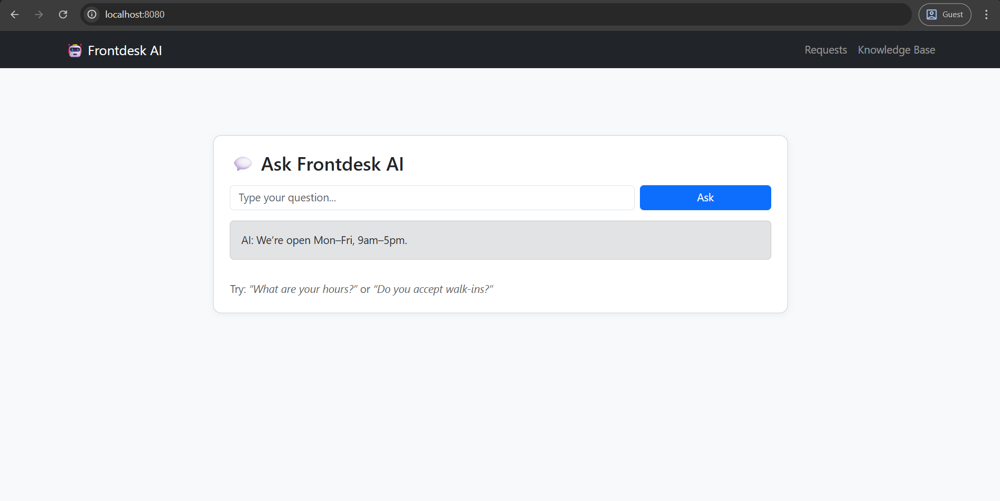
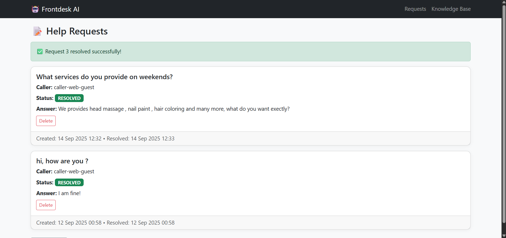
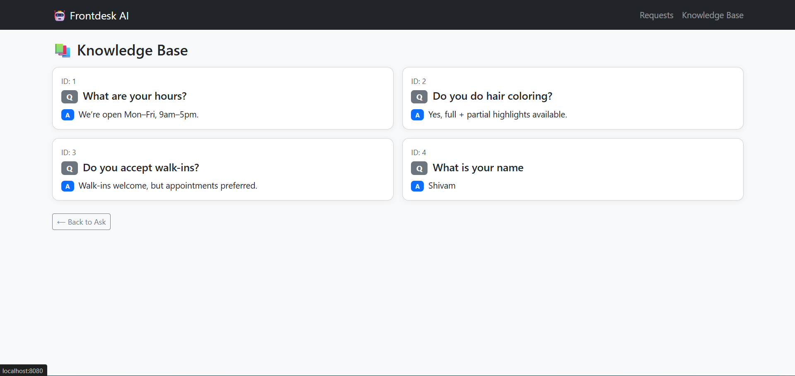

# 🤖 Human-in-the-Loop AI Agent (Frontdesk AI)

At Frontdesk, we are building AI receptionists that can manage customer relationships end-to-end.  
This project is a **prototype human-in-the-loop system**: when the AI agent doesn’t know an answer, it escalates to a human supervisor, learns the answer, and updates its knowledge base.

---

## 🎯 Goals
- Build a small system where:
    - AI answers known questions from its **Knowledge Base**.
    - Unknown questions become **Help Requests** (PENDING).
    - A supervisor resolves them, marking them **RESOLVED** or **UNRESOLVED**.
    - Resolved answers are automatically saved back into the Knowledge Base.
- Keep the UI **simple and admin-friendly**.

---

## 🛠 Tech Stack
- **Java 17**
- **Spring Boot** (Web, JPA, Thymeleaf, Scheduling)
- **H2 Database** (in-memory for fast testing)
- **Bootstrap 5** (for quick responsive UI)

---

## 🚀 Features
- **Ask AI (Home page):**
    - If the question is known → immediate AI answer.
    - If unknown → escalated to supervisor with `"Let me check with my supervisor..."`.

- **Help Requests (/requests):**
    - See all **Pending, Resolved, Unresolved** requests.
    - Resolve a request by entering an answer.
    - Lifecycle: `PENDING → RESOLVED` or auto-timeout to `UNRESOLVED`.

- **Knowledge Base (/knowledge):**
    - List of all learned Q&A pairs.
    - Pre-seeded with a few FAQs.
    - Expands automatically as supervisors resolve new requests.

- **Lifecycle Management:**
    - Automatic timeout → unresolved after **2 minutes** (configurable).
    - `customerId = "caller-web-guest"` simulates the caller identity.
    - Immediate “AI follow-up” simulated via console logs.

- **Voice Integration (Stub):**
    - Endpoint `POST /voice/transcript` allows simulated integration with LiveKit/Twilio.
    - Accepts `{ callerId, transcript }` and responds with `{ reply }`.

---

## 🖼 UI Screenshots

### 1. Ask AI


### 2. Help Requests (Pending)


### 3. Help Requests (Resolved)


### 4. Knowledge Base


---

## ⚙️ Setup & Run

### 1. Clone Repo
```bash
git clone https://github.com/yourusername/human-in-the-loop.git
cd human-in-the-loop
